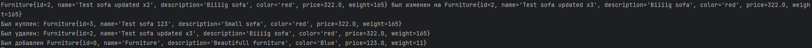
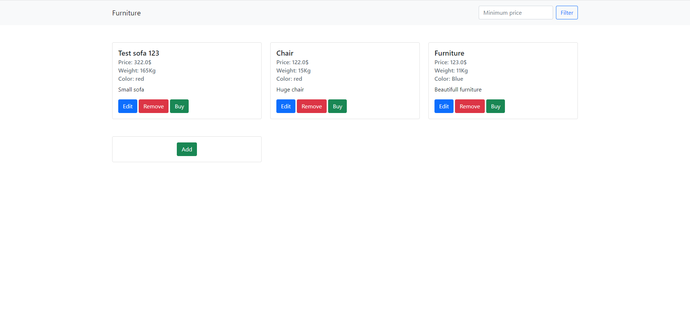

# Пр 8

Вариант 11: Мебель.

Модифицировалась 7 работа.

## Инструкция по запуску

Убедитесь в наличии на вашем устройстве [JDK](https://www.oracle.com/java/technologies/downloads/#jdk17-windows)

```
git clone https://github.com/infern397/RKIS-8.git
cd RKIS-8
psql -U postgres -c "CREATE DATABASE furniture_bd;"
activemq start
sh mvnw package
java -jar target/mvc-0.0.1-SNAPSHOT.jar
```

Открываем в браузере [главную страницу](http://127.0.0.1:8080)

_Для сборки необходим [Maven](https://maven.apache.org/download.cgi)_

_Для поддержки обмена сообщениями [ActiveMQ](https://activemq.apache.org/components/classic/download/)_

Функционал отправки сообщений и возможность покупки в приложении реализованы исключительно в формате web, не используя
REST.

Отправка сообщений осуществляется из контроллера и принимается в отдельном потоке, который периодически проверяет
очередь каждые 150 мс. Если в очереди есть сообщение, оно мгновенно выводится в терминал.

Поток завершается при остановке сервера, что реализовано с использованием аннотации @PreDestroy.


_Пример вывода сообщений в консоль_


_Изменение в шаблоне_
